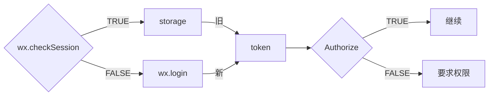
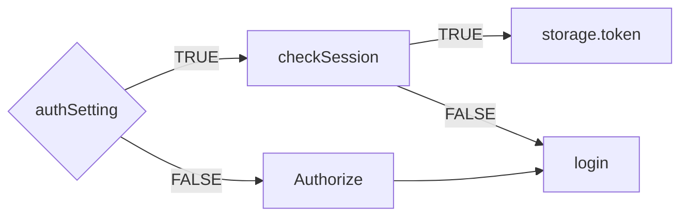

#### 学习周报2019.3.14

#### 2019.03.08 - 2019.03.14

### 2019.03.08

下午13点到15点， 2 hours，学习node基础

node是建立在`V8`引擎的web应用框架，使用`js`语言，是`CommonJS`的实现。

自带运行时环境

异步、事件驱动 =》 非阻塞

单线程


node应用的组成：

1. 载入node模块 `require()`
2. 创建服务器 ` http.createServer()`
3. 接收或者相应请求


npm是node的包管理工具

可以下载别人的包、命令行程序

讲自己写的包、命令行程序传到`npm`服务器上，供人使用

`npm uninstall` 卸载

`npm install`  、`npm i` 安装

`--save` 、`-S` 是安装到运行依赖

`--save-dev` 、`-D` 是安装开发依赖

`npm init` 是生成自己的包

`package.json` 存在于任何node应用程序、模块的根目录。

并用于定义一个包的属性。


捆绑了一个`REPL`环境。

可以执行，输入、计算、打印、循环

读取用户的输入，并解析输入的js数据结构，并储存在内存

采取并评估计算数据结构


**事件驱动编程**


在Node 应用，任何异步函数接受回调作为最后的参数

并回调函数接受错误作为第一个参数


事件发射器 EventEmitter类

所有的事件机制都是用设计模式中**观察者模式**实现。


缓冲模块 buffer

可以被用来创建缓冲区和SlowBuffer类

缓冲区是一种整数数组并对应于原始存储器V8堆以外分配


数据流

是从 源数据中读取 或 写入数据 到目标对象

有4种类型的流

`Readable` 用于读操作

`Writable` 用于写操作

`Duplex` 用于读取和写入

`Transform` 双向类型流，输出基于输入的计算


每种类型的流，都是事件发射器EventEmitter，并且一次引发了几个事件

一些常用事件：

data - 当有数据可读取时

end - 当没有更多数据可读取时

error - 当有错误或接收数据写入时

finish - 当所有数据已刷新到底层系统时

```js
var fs = require('fs');
var data = '';
var readerStream = fs.createReadStream('test.txt');

readerStream.setEncoding('UTF-8');

readerStream.on('data', function (chunk) {
    data += chunk;
});

readerStream.on('end', function (chunk) {
    console.log(data);
});

readerStream.on('error', function (err) {
   console.log(err.stack);
});

console.log('Program Ended');

// 从数据流中读取

var test = 'Sha Chou';

var writeStream = fs.createWriteStream('test1.txt');

writeStream.write(test, 'UTF-8');

writeStream.end();

writeStream.on('finish', function () {
    console.log('Write Finish')
});

writeStream.on('error', function (err) {
    console.log(err.stack)
});

console.log('Program ended');

```

管道流 - 一种机制

一个流的输出链接另一个流，做为另一个流的输入

`.pipe`


`fs`模块用于文件I/O

下午15点到17点， 2 hours，学习node基础

每一个`fs`模块的方法都有同步和异步形式。

异步方法接受一个**最后的参数为完成回调函数**，而**回调函数的第一个参数是错误**

下面是使用的参数的说明：

- **path** - 这是文件名，包括路径字符串。
- **flags** - 标志告知要打开的文件的行为。所有可能的值已经提及以下。
- **mode** - 这将设置文件模式(许可和粘性位)，但前提是在创建该文件。它默认为0666，读取和写入。
- **callback** - 这是回调函数得到两个参数(err, fd)。

标志进行读/写操作

| Flag | 描述                                                         |
| ---- | ------------------------------------------------------------ |
| r    | 打开文件进行读取。如果该文件不存在发生异常。                 |
| r+   | 打开文件进行读取和写入。如果该文件不存在发生异常。           |
| rs   | 打开文件，用于读取在同步方式。                               |
| rs+  | 打开文件进行读取和写入，告诉OS同步地打开它。对于'rs'有关使用此慎用见注解。 |
| w    | 打开文件进行写入。该文件被创建（如果它不存在）或截断（如果它存在）。 |
| wx   | 类似'w'，如果路径存在则失败。                                |
| w+   | 打开文件进行读取和写入。该文件被创建（如果它不存在）或截断（如果它存在）。 |
| wx+  | 类似“w+”，但如果路径存在则失败。                             |
| a    | 打开文件进行追加。如果它不存在，则创建该文件。               |
| ax   | 类似“a”，但如果路径存在则失败。                              |
| a+   | 打开文件进行读取和附加。如果它不存在，则创建该文件。         |
| ax+  | 类似'a+'，但如果路径存在则失败。                             |


常用的工具模块

1. `Console` - 控制台 - 用于打印和输出信息
2. `Process` - 进程 - 用于获取当前进程的信息，提供处理相关活动的多个事件
3. `OS` - 操作系统 - 提供与操作系统相关的实用功能
4. `Path` - 路径 - 用于处理和转化文件路径
5. `Net` - 网络 -  网络应用包， 提供服务器和客户端的数据流
6. `DNS` - 能做实际的DNS查找，以及使用底层操作系统的名称解析功能
7. `Domain` - 处理多个不同的`I/O`操作为一组


**`console.time(label)`** 标记时间

**`console.timeEnd(label) `** 完成定时，记录输出


#### 进程 process

退出码

节点正常退出，退出码是0


事件

进程是一个事件发射器

**exit**  退出

**beforeExit** 没有预定的工作了，将要退出，可以捕获这个事件，进行异步调用，使node继续工作

**uncaughtException**

**Signal Events**  信号


特性 、方法


#### 全局对象

`_filename`

返回当前文件的绝对路径

`_dirname`

返回当前文件所在目录的绝对路径

定时器、计时器不能跨越超过24.8天。


#### web

`web`应用程序体系结构

client - 客户端 浏览器、app一类的，可以通过http协议向服务器请求数据

server - 服务端 可以接受客户端请求，并向客户端发送响应数据

business - 业务层 与数据库交互、逻辑运算、调用外部程序

data - 数据库等数据来源


下午17点到18点30， 1.5 hours，学习node基础

`RESTful` API

`REST`表述性状态传递，是一组架构约束条件和原则

是设计风格，不是标准


### 2019.03.11 星期一

上午 10：30 - 12：00  **web服务器**

1. `http.createServer`起一个服务
2. 解析访问路径，过滤 `/favicon.ico` 的请求
3. `fs.readFile`读取首页文件，不存在读取404页面
4. 文件存在，设置响应头`Content-Type`
5. `write`写入文件，`end`响应结束

要点：

1. 设置响应头，按文件类型不同，对应不同的`Content-Type`;
2. 操作分同步（例如：`readFileSync`）、异步


下午 13:00-15:00  **node基础+MySQL入门**

**非阻塞I/O, Events模块**

用自己的话讲一下什么是非阻塞I/O

node用回调实现函数的异步调用，node是单线程的，但是异步不会阻塞代码执行，就算异步函数报错了，别的代码也能执行。

回调和Events模块都可以解决函数与函数之间执行顺序的问题。

事件发射器 `events.EventEmitter()`

实例化一个事件发射器 `emit`广播，`on`监听

`get`与`post`

跨域会发送两次请求 ，第一次options请求会询问是否允许跨域，返回true后，发起第二次请求

跨域要设置响应头

```js
http.createServer((req, res)=>{
    res.setHeader('Access-Control-Allow-Origin', '*');
    res.setHeader('Access-Control-Allow-Headers', 'Content-Type');
    res.setHeader('Content-Type', 'application/json');

    switch (req.method) {

        // post 请求时，浏览器会先发一次options请求，如果请求通过，则继续发送正式的post请求。
        case 'OPTIONS':
            res.statusCode = 200;
            res.end();
            break;
        case 'GET':
            let data = JSON.stringify(items);
            res.write(data);
            res.end();
            break;
        case 'POST':
            let item = '';
            req.on('data',(chunk) => {
                item += chunk;
            });
            // 数据发送完毕
            req.on('end', ()=>{
                item = JSON.parse(item);
                items.push(item.item);
                let data = JSON.stringify(items);
                res.write(data);
                res.end()
            });
            break
    }
}).listen(3000);
```

只判断了请求是`get`还是`post`，然后返回结果

### 2019.03.12 星期二

上午 10：30 - 11：10  **看weUI文档，下午写一个公众号投诉页**

可以用react-weui 

https://weui.github.io/react-weui/docs/#/react-weui/docs/page/0/articles/0

发现类似的页面直接拿来改一下用了

http://www.100bigger.com/complain.html

上午 11：10 - 12：00  **调打卡接口**

H5页面要改一下换token的接口

别的接口可能还有要改的，下午过一下

小程序部分，已经理顺了，开始写登录。

调通了微信登录的三个接口。

### 2019.03.13 星期三

上午 10:00 - 11:00 一个小时 研究一下webpack的路径问题，看一些技术的简介

**story-book**

是UI组件的开发环境。

它允许您浏览组件库，查看每个组件的不同状态，以及交互式开发和测试组件。

支持很多框架，包括vue和react。

**ESLint**

类似的有JSLint、JSHint

是一个JS和JSX的代码检查工具

灵活，任意的规则都是配置的，独立的，可插拔的

没有固定的规则，都可以自己配

**Jest**

是 Facebook 的一套开源的 JavaScript 测试框架， 它自动集成了断言、JSDom、覆盖率报告等开发者所需要的所有测试工具，是一款几乎零配置的测试框架。

并且它对同样是 Facebook 的开源前端框架 React 的测试十分友好。

#### webpack路径

1. node中的`require`

   `require`中的路径是一个变量的话，不要直接传一个变量，会报错。

   尽量写上一部分能确定的路径，比如`require("@/assets/images/carousel/"+url)`

   如果直接传入一个变量，这个文件可能是计算机上的任意一个文件

   开发过程中 ，`webpack`先编译，再打包，最后热加载到页面

2. `webpack`将项目中的静态资源编译打包后，生成的路径已经不是原来那个了。

   会进行相应的一系列处理。

`Vue Loader`在编译单文件中的`<template>`块时，**将资源url转成模块请求**

1. 如果是绝对路径，会被保留（很可能出错，也不应该这样的，因为打包后的代码，资源根据绝对路径还是引向了资源的开发路径）。
2. 以`./`开头，会被看做相对的依赖模块。
3. 以`@/`开头，会被看做模块依赖。webpack配置中给@配置了alias，这就是ok的。`vue-cli`中给`@`配置的是`/src`。
4. 以`~/`开头，后面的部分会被看做模块依赖。既可以加载**含有别名的静态资源**，又可以**加载`node-modules`中的资源**。

由于`vue-loader`在处理style时，采用的是`style-loader`，所以可能 和上面`<template>`部分的转换规则不太一样。

### 2019.03.14 星期四

打卡小程序 - H5通过`web-view`嵌入小程序

解决了分享和支付的问题

遇到一个bug，bug描述：

用户登录小程序并同意授权，在没有删除小程序的情况下，关闭了授权，再次进入。

目前的写法是：

1. `wx.checkSession`，`true`在`storage`里拿`token`，`false`去`wx.login`拿到新的`token`。
2. 检查授权。



在再次要求授权，用户同意的时候，**报错**了！

后端拿旧的token去请求的时候，显示session过期了， 而我之前查过的，是true，那么也就有一种可能，**再次授权的时候，session刷新了**。

调整登录的流程为如下：

先检查授权。

没有授权，请求授权再，login换取token。

有授权，去**`checkSession`**，这样就避过了这种情况。

尝试一下：



OK问题解决了，这么看的话，应该就是授权的时候，session刷新了


