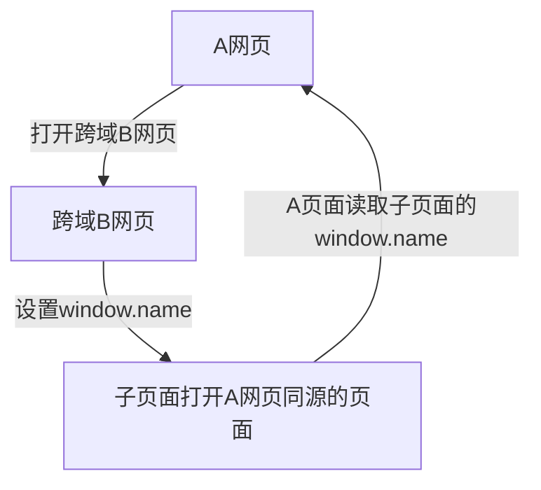

#### 学习周报

#### 2019.06.01 - 2019.06.07

### 2019.06.01

## 上一周工作中遇到的点

### element的UI框架的使用心得

#### 表格

`<el-table>` + `:data="tableData"`表格和数据

`<el-table-column>`+`prop="date"`每列和对应表格数据中的项

`width="180"` 可以设定每列的宽度

`label="日期"`是标签

可以带边框、带状态(悬停的样式啦一类的)，固定表头，固定列，

数据动态变化时，可以给表格设置动态高度

多级表头，支持单选、多选

设`type`属性为`selection`，即多选

可以通过标签对数据进行快速筛选

可以自定义内容：

```vue
<template slot-scope="scope">
  <i class="el-icon-time"></i>
  <span style="margin-left: 10px">{{ scope.row.date }}</span>
</template>
```

可以自定义表头、表的内容

支持懒加载、可以自定义索引。

#### 表单


### 浏览器同源策略的规避方式

#### 同源策略的含义：

协议相同、域名相同、端口相同

#### 目的：

为了保护用户信息的安全。如果某网站可以随意读取用户别的网站的cookie，那么不仅能拿到保存在这个cookie里面的信息，如果用户没有退出登录，那么也可以冒充用户去登陆对应的网站。

#### 限制范围：(三个)

1. Cookie，LocalStorage，IndexDB
2. DOM
3. Ajax不能发送

#### Cookie

如果一级域名相同，就可以设置

```javascript
document.domain = 'example.com'; // 一级域名
```

这种方法只适用于 Cookie 和 iframe 窗口

服务器也可以在设置Cookie的时候，指定Cookie的所属域名为一级域名

```http
Set-Cookie: key=value; domain=.example.com; path=/
```

这样的话，二级域名和三级域名不用做任何设置，都可以读取这个Cookie。

#### iframe获取DOM

使用`document.domain`也可以解决，一级域名相同，二级、三级域名不同的同源策略限制。

#### 完全不同源的网站，目前三种方法，可以解决跨域窗口的通信问题

1. 片段识别符hash
2. window.name
3. 跨文档通信API

#### 片段识别符

是#后面的内容，改变这个页面不刷新

可以用这个，父子页面之间传值

父窗口可以把信息，写入子窗口的片段标识符。

```javascript
document.getElementById('myIFrame').src = src;
```

子窗口通过监听`hashchange`事件得到通知。

子窗口也可以改变父窗口的片段标识符。

```javascript
parent.location.href= target + "#" + hash;
```

#### window.name 

无论是否同源，只要在同一个窗口里，前一个网页设置了这个属性，后一个网页可以读取它。



优点：

容量很大，可以放置非常长的字符串(根据浏览器的url长度限制，ie的2083个字符，chrome的8082个字符)

缺点：

必须监听子窗口的window.name属性的变化，影响性能

####  跨文档通信API

上面2种方法都属于破解，html5有个全新的API来解决这个问题

`	window.postMessage`

允许跨窗口通信，不论这两个窗口是否同源。

```javascript
var popup = window.open('http://bbb.com', 'title');
popup.postMessage('Hello World!', 'http://bbb.com');
```

父窗口和子窗口都可以通过`message`事件，监听对方的消息。

```javascript
window.addEventListener('message', function(e) {
  console.log(e.data);
},false);
```

通过`window.postMessage`，读写其他窗口的 LocalStorage 也成为了可能。

### Ajax的请求有三种方式规避

架设服务器代理并不算在内，只是把非同源的请求，通过代理，成了同源请求。

#### JSONP

简单适用，老旧浏览器全部支持

网页添加一个`<script>`标签，向服务器请求JSON数据，这个不受同源策略的限制。

服务器接收到请求之后，将数据放到一个**指定名字的回调函数**里面传回去。

该请求的查询字符串有一个`callback`参数，用来指定回调函数的名字，这对于JSONP是必需的。

JSONP只能发`GET`请求

#### WebSocket

WebSocket是一种通信协议，使用`ws://`（非加密）和`wss://`（加密）作为协议前缀。该协议不实行同源政策，只要服务器支持，就可以通过它进行跨源通信。

WebSocket请求的头信息，里面有个`Origin`字段，表示该请求的请求源（origin），即发自哪个域名。

服务器可以根据这个字段，判断是否许可本次通信。

#### CORS

CORS是跨源资源分享（Cross-Origin Resource Sharing）的缩写。

它是W3C标准，是跨源AJAX请求的根本解决方法。

CORS允许任何类型的请求。

CORS需要浏览器和服务器同时支持。

目前，所有浏览器都支持该功能，IE浏览器不能低于IE10。

浏览器将CORS请求分成两类：

简单请求（simple request）和非简单请求（not-so-simple request）。

只要同时满足以下两大条件，就属于简单请求。

> （1) 请求方法是以下三种方法之一：
>
> - HEAD
> - GET
> - POST
>
> （2）HTTP的头信息不超出以下几种字段：
>
> - Accept
> - Accept-Language
> - Content-Language
> - Last-Event-ID
> - Content-Type：只限于三个值`application/x-www-form-urlencoded`、`multipart/form-data`、`text/plain`

#### 简单请求的流程


#### 非简单请求的流程


### ajax的几个属性的意义与http的基础知识

#### Content-Type

#### data-type

#### http的post和get的区别

### 文件上传插件的使用

使用element的文件上传插件，首先有一个上传文件的接口，返回文件的网络地址，使用blob格式传输。

带有预览，数量限制，带参传输，预加载，等功能。


以下是有过记录的几点：

#### .vue文件中的样式问题

1. 标签选择器的使用
2. 组件的样式继承

####vuex的模块拆分和使用

####es6/7/8新语法的使用心得：

####以及后面一周的工作内容和学习内容的规划：


